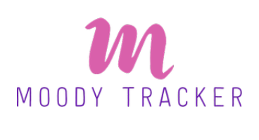

<p align="center">

</p>

# Moody Tracker Backend

Moody Tracker is a mental health tracking system that facilitates awareness and reflection of moods, so users can better
understand the influencing factors, and thus be able to change these to improve their mental health. For those who are already battling various mental health disorders, the system aids in their treatment process as it provides their respective therapist previous mental health data of the patient.

## Technologies

- <span style="color: blue">Ruby</span>
- <span style="color: blue">Ruby on Rails</span>
- <span style="color: blue">Mysql</span>

# Getting Started

## Prerequisites

- ruby v2.7 and above
- rails v6 and above
- Mysql installed locally

## How to Install and Run the Project

Clone the repository

```
git clone https://github.com/kenny-kogi/MoodyTracker-Backend.git
```

Change Directory

```
cd MoodyTracker/
```

Install Packages

```
bundle install
```

Usage

```
run rails s
```

Open postman localhoost:3001 to see the available endpoints
